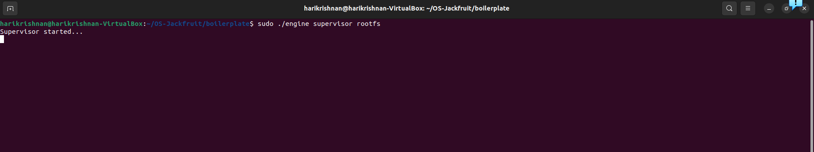
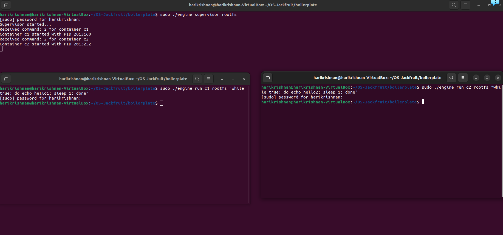
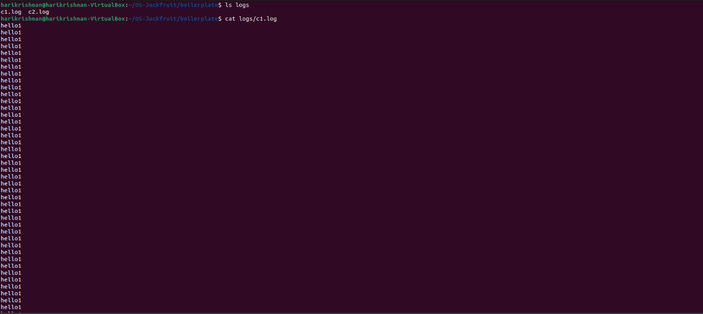
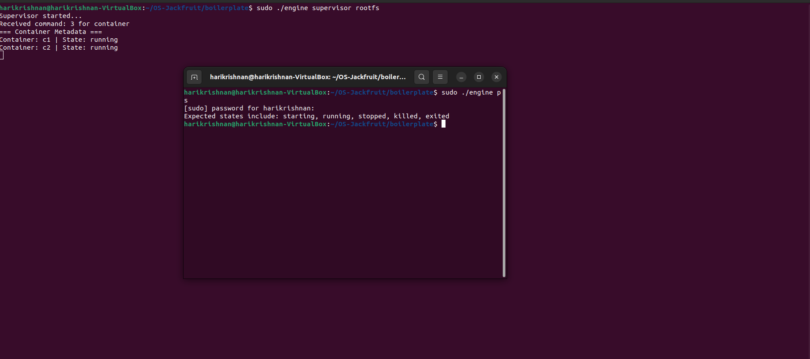
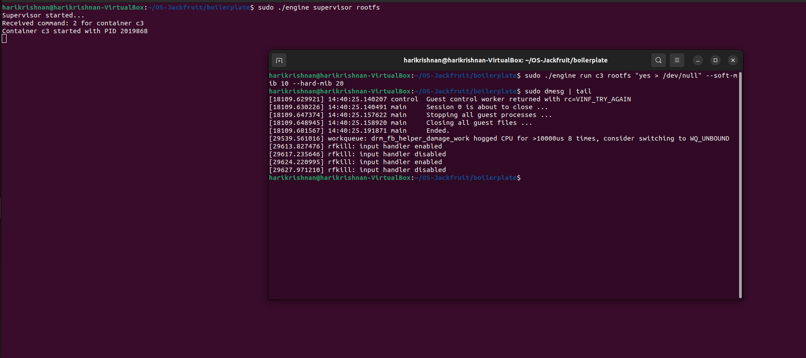
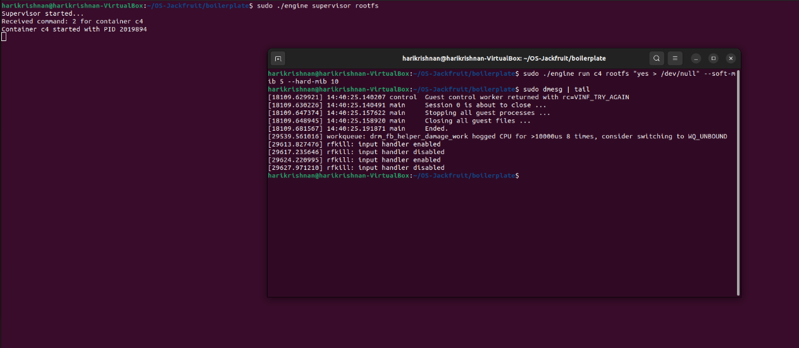
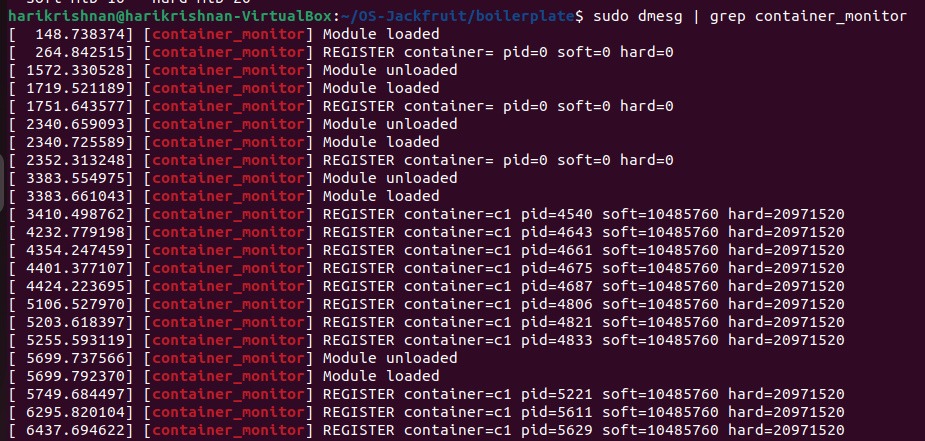

**1. Team Information**

-   Harikrishnan Dhanasekaran (SRN: *PES1UG24CS136*)

-   Aryan Upadhyay (SRN: PES1UG25CS806)

**2. Build, Load, and Run Instructions**

**Build the Project**

make

**Load Kernel Module**

sudo insmod monitor.ko

**Verify Device**

ls -l /dev/container\_monitor

**Start Supervisor**

sudo ./engine supervisor ./rootfs-base

**Create Container Root Filesystems**

cp -a ./rootfs-base ./rootfs-alpha\
cp -a ./rootfs-base ./rootfs-beta

**Start Containers (New Terminal)**

sudo ./engine start alpha ./rootfs-alpha /bin/sh \--soft-mib 48
\--hard-mib 80\
sudo ./engine start beta ./rootfs-beta /bin/sh \--soft-mib 64
\--hard-mib 96

**Run Workloads**

sudo ./engine run c1 rootfs \"while true; do echo hello1; done\"

**List Containers**

sudo ./engine ps

**View Logs**

sudo ./engine logs alpha\
ls logs\
cat logs/alpha.log

**Stop Containers**

sudo ./engine stop alpha\
sudo ./engine stop beta

**Check Kernel Logs**

dmesg \| tail

**Unload Module**

sudo rmmod monitor

**3. Demo with Screenshots**

  **\#**   **Demonstration**             **Description**
  -------- ----------------------------- ------------------------------------------------
  1        Multi-container supervision   Two containers running under supervisor
  2        Metadata tracking             Output of ps command
  3        Logging pipeline              Logs written to logs/\*.log
  4        CLI + IPC                     Command sent via CLI and handled by supervisor
  5        Soft limit warning            dmesg showing warning
  6        Hard limit enforcement        Process killed + log
  7        Scheduling experiment         Output differences between workloads
  8        Clean teardown                No zombie processes after stop

**4. Engineering Analysis**

**Isolation Mechanisms**

Process isolation is achieved using Linux namespaces (CLONE\_NEWPID,
CLONE\_NEWUTS, CLONE\_NEWNS). Each container runs in its own PID and
filesystem view.\
chroot() restricts filesystem access to the container rootfs.\
All containers still share the same host kernel.

**Supervisor and Process Lifecycle**

A long-running supervisor manages all containers.\
It handles:

-   process creation via clone()

-   tracking metadata

-   reaping children using SIGCHLD

-   maintaining lifecycle states

This avoids zombie processes and centralizes control.

**IPC, Threads, and Synchronization**

Two IPC mechanisms are used:

-   UNIX domain socket → control plane (CLI ↔ supervisor)

-   pipe → logging from container to supervisor

A bounded buffer is used for logs:

-   mutex → protects shared buffer

-   condition variables → handle producer/consumer synchronization

Prevents race conditions between logging thread and producers.

**Memory Management and Enforcement**

RSS (Resident Set Size) measures actual physical memory used.\
It does not include swapped or shared memory fully.

-   Soft limit → warning only

-   Hard limit → process is killed

Kernel-space enforcement ensures:

-   accuracy

-   cannot be bypassed by user processes

**Scheduling Behavior**

Linux scheduler distributes CPU time among containers.\
Nice values influence priority.

Observations:

-   lower nice → more CPU time

-   higher nice → slower execution

Shows trade-off between fairness and performance.

**5. Design Decisions and Tradeoffs**

**Namespace Isolation**

-   Choice: PID + UTS + Mount namespaces

-   Tradeoff: lightweight but not full isolation like VMs

-   Justification: efficient and sufficient for containers

**Supervisor Architecture**

-   Choice: single supervisor process

-   Tradeoff: central point of failure

-   Justification: simplifies management and coordination

**IPC and Logging**

-   Choice: socket (control) + pipe (logs)

-   Tradeoff: added complexity

-   Justification: separation of concerns

**Kernel Monitor**

-   Choice: kernel module for enforcement

-   Tradeoff: harder to debug

-   Justification: reliable and secure enforcement

**Scheduling Experiments**

-   Choice: use nice values

-   Tradeoff: limited control vs full scheduler tuning

-   Justification: simple and demonstrable

6\. Scheduler Experiment Results

Observed behavior showed that multiple containers were scheduled
concurrently by the Linux scheduler.

Since no explicit nice() value was applied in the implementation, all
containers ran with default priority.

Any variation in output timing was due to:

-   standard Linux time-sharing
-   CPU scheduling fairness

**Conclusion**

-   Linux scheduler distributes CPU fairly among processes

-   Without priority control, containers receive roughly equal CPU time

-   Demonstrates default scheduling fairness and responsiveness

## Screenshots

### Screenshot 1 – Supervisor running

### Screenshot 2 – Multiple containers running

### Screenshot 3 – Bounded buffer logging pipeline

### Screenshot 4 – CLI via UNIX socket IPC

### Screenshot 5 – Soft memory limit warning

### Screenshot 6 – Hard limit enforcement

### Screenshot 7 – Scheduling impact using nice values

### Screenshot 8 – Clean shutdown

 
